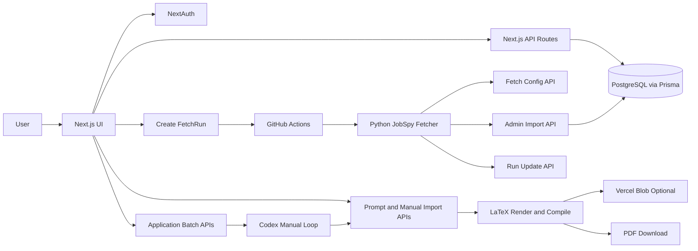

# Jobflow

A practical job-search command center: fetch roles, triage quickly, tailor resume and cover letter content, and export production-ready PDFs.


<!-- AUTO_METRICS_BADGES_START -->


<!-- Generated by: npm run readme:metrics -->
<!-- AUTO_METRICS_BADGES_END -->

## Table of Contents

- [What Jobflow Does](#what-jobflow-does)
- [Core Features](#core-features)
- [Technology Stack](#technology-stack)
- [Architecture](#architecture)
- [Project Structure](#project-structure)
- [Quick Start](#quick-start)
- [Scripts](#scripts)
- [Codex Batch Workflow](#codex-batch-workflow)
- [Environment Variables](#environment-variables)
- [Deployment](#deployment)
- [Troubleshooting](#troubleshooting)
- [License](#license)

## What Jobflow Does

Jobflow is designed as a production workflow product, not a prompt-only demo.

- End-to-end flow: intake, triage, tracking, tailoring, export
- Reliable data path: dedupe, tombstone filtering, guarded imports
- Controllable AI path: external-model prompt flow with strict import validation
- Prompt governance: versioned rule templates plus skill-pack delivery
- Delivery-ready output: LaTeX-based Resume and Cover Letter PDFs

## Core Features

1. Job intake pipeline
- Create `FetchRun` tasks from `/fetch`
- Dispatch GitHub Actions to run Python JobSpy fetcher
- Pull run config and push run status through secured API routes
- Import with unique-key dedupe (`userId + jobUrl`) and deleted-URL tombstones

2. Jobs workspace
- Two-pane review UI for fast scanning and deep JD reading
- Search/filter/pagination and status transitions (`NEW`, `APPLIED`, `REJECTED`)
- Markdown JD rendering and keyword highlighting

3. Resume studio
- Multi-step master-resume editor (basics, summary, experience, projects, education, skills)
- Bullet-level edits with markdown emphasis
- Preview and save workflow

4. Prompt rules and skill pack
- Create, activate, and reset versioned prompt templates
- Download global skill pack for external model workflows
- Optional redacted skill-pack export for safer sharing

5. Tailoring and manual import
- Prompt generation for resume and cover targets
- Manual JSON import path (`copy prompt -> external model -> import`)
- Guardrails: strict schema checks, `promptMeta` consistency, evidence-grounded bullet additions

6. PDF delivery
- Resume/Cover LaTeX rendering and PDF download
- Optional persistent PDF storage via Vercel Blob

7. Codex batch run (manual AI loop)
- Create a `NEW`-scope batch from filtered jobs
- Claim tasks through `/api/application-batches/:id/codex-run`
- Generate JSON and import through `/api/applications/manual-generate`
- Mark task status through `/api/application-batches/:id/tasks/:taskId`
- Track completion via `/api/application-batches/:id/summary`

## Technology Stack

| Domain | Technology | Status |
|---|---|---|
| Frontend | Next.js 16 (App Router), React 19, TypeScript | Active |
| UI | Tailwind CSS v4, Radix UI, shadcn-style components, Framer Motion | Active |
| Auth | NextAuth (GitHub + Google) | Active |
| Backend API | Next.js Route Handlers + Zod validation | Active |
| ORM | Prisma 7 | Active |
| Database | PostgreSQL | Active |
| DB Adapter | Neon (`@prisma/adapter-neon`, `@neondatabase/serverless`) | Active |
| Deployment | Vercel | Active |
| CI | GitHub Actions | Active |
| Fetch Worker | Python JobSpy | Active |
| AI Provider | Gemini API with fallback path | Active when configured |
| Storage | Vercel Blob | Optional |
| PDF Engine | LaTeX compile pipeline | Active |
| Testing | Vitest + Testing Library | Active |

## Architecture



## Project Structure

- `app/(marketing)` marketing pages
- `app/(auth)` auth pages
- `app/(app)` workspace (`jobs`, `fetch`, `resume`, `resume/rules`)
- `app/api` backend routes
- `lib/server` domain services (AI, prompts, PDF, persistence)
- `prisma/schema.prisma` data models
- `tools/fetcher` fetcher integration
- `test` test suites

## Quick Start

```bash
npm install
npm run dev
```

Open `http://localhost:3000`.

## Scripts

- `npm run dev` local development
- `npm run build` production build
- `npm run start` production server
- `npm run lint` lint
- `npm test` run tests
- `npm run test:watch` watch mode
- `npm run readme:metrics` refresh auto-metrics badges

## Codex Batch Workflow

1. Fetch jobs and keep only target roles as `NEW`.
2. Create batch: `POST /api/application-batches` with scope `NEW`.
3. In the Codex loop:
- Call `POST /api/application-batches/:id/codex-run`
- For each task, call `POST /api/applications/prompt` (`target=resume|cover`)
- Generate JSON with your external model
- Call `POST /api/applications/manual-generate`
- Call `PATCH /api/application-batches/:id/tasks/:taskId` with `SUCCEEDED` or `FAILED`
4. Check progress with `GET /api/application-batches/:id/summary`.

## Environment Variables

Create a `.env` file in the project root.

App and auth
- `DATABASE_URL`
- `NEXTAUTH_SECRET` or `AUTH_SECRET`
- `NEXTAUTH_URL`
- `GOOGLE_CLIENT_ID`
- `GOOGLE_CLIENT_SECRET`
- `GITHUB_ID`
- `GITHUB_SECRET`

Fetch and workflow
- `GITHUB_OWNER`
- `GITHUB_REPO`
- `GITHUB_TOKEN` (workflow scope required)
- `GITHUB_WORKFLOW_FILE` (default: `jobspy-fetch.yml`)
- `GITHUB_REF` (default: `master`)
- `JOBFLOW_WEB_URL`
- `FETCH_RUN_SECRET`
- `IMPORT_SECRET`

AI and files
- `GEMINI_API_KEY`
- `GEMINI_MODEL` (optional)
- `BLOB_READ_WRITE_TOKEN` (optional)

## Deployment

- Recommended: Vercel + Neon (PostgreSQL)
- Configure all environment variables in the deployment platform
- If deploying from a subdirectory, set root directory to `jobflow`

## Troubleshooting

- `GITHUB_DISPATCH_FAILED`: verify workflow token permissions
- Low import volume: increase fetch breadth or relax excludes
- `PROMPT_META_MISMATCH`: re-download skill pack and re-copy prompt
- `/api/application-batches/:id/trigger` returns `TRIGGER_DISABLED` by design; use `codex-run`

## License

Apache License 2.0. See `LICENSE` and `NOTICE`.

