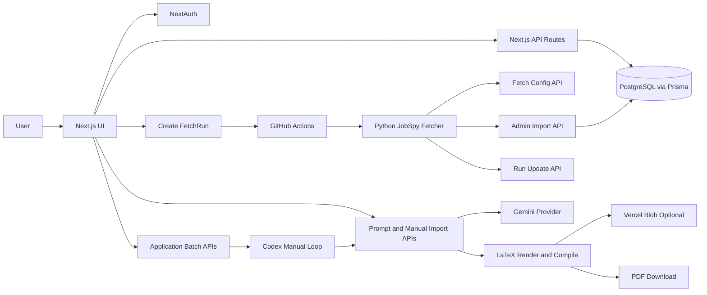

# Jobflow 🚀

A practical job search command center: fetch roles, review fast, tailor CV/Cover Letter, and export production-ready PDFs.

[English](#english) | [Chinese 中文](#chinese-中文)


<!-- AUTO_METRICS_BADGES_START -->


<!-- Generated by: npm run readme:metrics -->
<!-- AUTO_METRICS_BADGES_END -->

## Table of Contents

- [English](#english)
- [Chinese 中文](#chinese-中文)

## Quick Navigation

[Live Demo](#live-demo) · [Architecture](#architecture) · [Tech Stack](#key-technology-stack) · [Quick Start](#quick-start) · [Chinese](#chinese-中文)

## English

### What Jobflow Does

Jobflow is built as a real workflow product, not a prompt-only demo.

- End-to-end flow: role intake, triage, tracking, tailoring, export
- Reliable data path: dedupe, tombstone filtering, guarded imports
- Controllable AI: automatic generation plus manual external-model import
- Prompt governance: versioned rule templates + skill pack delivery
- Delivery-ready output: LaTeX-based Resume and Cover Letter PDFs

### Core Features

1. **Job Intake Pipeline**
- Create `FetchRun` tasks from `/fetch`
- Dispatch GitHub Actions to run Python JobSpy fetcher
- Pull run config and push run status through secured API routes
- Import with unique-key dedupe (`userId + jobUrl`) and deleted-URL tombstones

2. **Jobs Workspace**
- Two-pane review UI for fast list scanning and deep JD reading
- Search/filter/pagination and status transitions (`NEW`, `APPLIED`, `REJECTED`)
- Markdown JD rendering and keyword highlighting

3. **Resume Studio**
- Multi-step master resume editor (basics, summary, experience, projects, education, skills)
- Bullet-level edits with markdown emphasis
- Preview + save workflow

4. **Prompt Rules + Skill Pack**
- Create/activate/reset versioned prompt templates
- Download global skill pack for external model workflows

5. **AI Tailoring + Manual Import**
- AI tailoring with fallback when provider/key/output is unavailable
- Manual JSON import path (`copy prompt -> external model -> import`)
- Guardrails: strict schema checks, `promptMeta` consistency, evidence-grounded bullet additions

6. **PDF Delivery**
- Resume/Cover LaTeX rendering and PDF download
- Optional persistent resume PDF storage via Vercel Blob
- Cover PDF persistence is also supported when blob token is configured

7. **Codex Batch Run (Manual AI Loop)**
- Create a `NEW`-scope batch from filtered jobs
- Use `/api/application-batches/:id/codex-run` to claim tasks + prompt context
- Generate JSON (resume/cover) and import via `/api/applications/manual-generate`
- Mark task status via `/api/application-batches/:id/tasks/:taskId`
- Track completion via `/api/application-batches/:id/summary`

### Key Technology Stack

| Domain | Technology | Usage Status |
|---|---|---|
| Frontend | Next.js 16 (App Router), React 19, TypeScript | Active |
| UI | Tailwind CSS v4, Radix UI, shadcn-style components, Framer Motion | Active |
| Auth | NextAuth (GitHub + Google) | Active |
| Backend API | Next.js Route Handlers + Zod validation | Active |
| ORM/Data Layer | Prisma 7 | Active |
| Database | PostgreSQL | Active |
| DB Platform Adapter | Neon (`@prisma/adapter-neon`, `@neondatabase/serverless`) | Active |
| Deployment Cloud | Vercel | Active |
| CI/Automation | GitHub Actions | Active |
| External Fetch Worker | Python JobSpy | Active |
| AI Provider | Gemini API with safe fallback path | Active when configured |
| File Storage | Vercel Blob | Optional |
| PDF Engine | LaTeX compile pipeline | Active |
| Testing | Vitest + Testing Library | Active |
| Azure | Mentioned in historical design docs | Not active in current runtime |

### Architecture



### Live Demo

- Local demo: `http://localhost:3000`
- Cloud deployment: Vercel (set env vars, then deploy)

### Project Structure

- `app/(marketing)` marketing pages
- `app/(auth)` auth pages
- `app/(app)` app workspace (`jobs`, `fetch`, `resume`, `resume/rules`)
- `app/api` backend routes
- `lib/server` domain services (AI, prompts, PDF, persistence)
- `prisma/schema.prisma` data models
- `tools/fetcher` fetcher integration
- `test` test suites

### Quick Start

```bash
npm install
npm run dev
```

Open `http://localhost:3000`

### Scripts

- `npm run dev` local development
- `npm run build` production build
- `npm run start` production server
- `npm run lint` lint
- `npm test` run tests
- `npm run test:watch` test watch mode
- `npm run readme:metrics` refresh auto metrics badges

### Codex Batch Workflow

1. Fetch jobs and keep only roles you want as `NEW`.
2. Create batch: `POST /api/application-batches` (scope `NEW`).
3. In Codex loop:
   - call `POST /api/application-batches/:id/codex-run`
   - for each returned task:
     - call `POST /api/applications/prompt` (`target=resume|cover`)
     - generate JSON with your model
     - call `POST /api/applications/manual-generate`
     - call `PATCH /api/application-batches/:id/tasks/:taskId` with `SUCCEEDED` or `FAILED`
4. Check progress/remaining/failed with `GET /api/application-batches/:id/summary`.

### Environment Variables

Create a `.env` file in the project root.

**App + Auth**
- `DATABASE_URL`
- `NEXTAUTH_SECRET` or `AUTH_SECRET`
- `NEXTAUTH_URL`
- `GOOGLE_CLIENT_ID`
- `GOOGLE_CLIENT_SECRET`
- `GITHUB_ID`
- `GITHUB_SECRET`

**Fetch + Workflow**
- `GITHUB_OWNER`
- `GITHUB_REPO`
- `GITHUB_TOKEN` (workflow scope required)
- `GITHUB_WORKFLOW_FILE` (default: `jobspy-fetch.yml`)
- `GITHUB_REF` (default: `master`)
- `JOBFLOW_WEB_URL`
- `FETCH_RUN_SECRET`
- `IMPORT_SECRET`

**AI + Files**
- `GEMINI_API_KEY`
- `GEMINI_MODEL` (optional)
- `BLOB_READ_WRITE_TOKEN` (optional)

### Deployment

- Recommended: Vercel + Neon (PostgreSQL)
- Configure all env vars in deployment platform
- If deploying from a subdirectory, set root directory to `jobflow`

### Troubleshooting

- `GITHUB_DISPATCH_FAILED`: check workflow token permissions
- Low import volume: increase `resultsWanted` / `hoursOld` or relax excludes
- `PROMPT_META_MISMATCH`: regenerate skill pack and prompt
- `/api/application-batches/:id/trigger` returns `TRIGGER_DISABLED` by design; use `codex-run` loop

### License

Apache License 2.0. See `LICENSE` and `NOTICE`.

---

## Chinese (中文)

### 项目定位

Jobflow 是一个真实可用的求职工作台：抓取职位、筛选跟进、定制简历与求职信，并导出 PDF。

- 全链路闭环：抓取 -> 评估 -> 跟进 -> 产出
- 数据稳定：去重、墓碑机制、安全导入
- AI 可控：自动生成 + 手动导入双路径
- 规则可治理：Prompt 版本化与 Skill Pack
- 可直接交付：Resume/Cover Letter PDF

### 关键能力

- 抓取链路：`FetchRun` + GitHub Actions + Python JobSpy + 安全回调接口
- 职位工作台：双栏浏览、搜索筛选、状态管理、JD 渲染
- 主简历编辑：多步骤结构化维护与预览
- Prompt Rules：版本化、激活、恢复默认、Skill Pack 下载
- 定制生成：AI + 手动导入，带严格校验与证据约束
- PDF 输出：LaTeX 渲染，支持 Vercel Blob 可选持久化

### 关键技术栈

- 前端：Next.js 16、React 19、TypeScript、Tailwind CSS v4、Radix UI
- 后端：Next.js API Routes、Zod、Prisma 7
- 数据库：PostgreSQL（Neon 适配）
- 云与自动化：Vercel、GitHub Actions、Python JobSpy
- AI 与内容：Gemini、React Markdown、LaTeX
- 存储：Vercel Blob（可选）
- 测试：Vitest + Testing Library
- Azure：当前运行链路未启用，仅历史设计文档提及

### 快速开始

```bash
npm install
npm run dev
```

访问 `http://localhost:3000`

### 许可证

Apache License 2.0，见 `LICENSE` 与 `NOTICE`。
