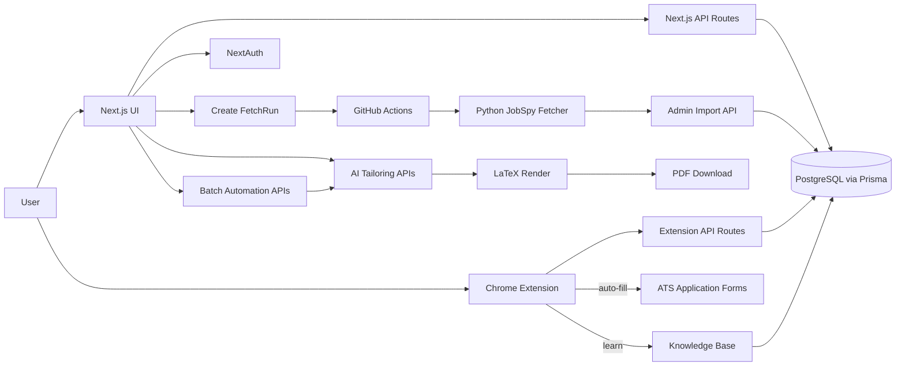

# Joblit

Full-cycle job search workstation: fetch roles, triage, tailor resumes, auto-fill applications with a self-learning Chrome extension, and export production-ready PDFs.


<!-- AUTO_METRICS_BADGES_START -->


<!-- Generated by: npm run readme:metrics -->
<!-- AUTO_METRICS_BADGES_END -->

## Why Joblit

Most job-search tools stop at listing or tracking. Joblit closes the entire loop:

| Stage | What Joblit Does | How |
|---|---|---|
| **Discover** | Batch-fetch roles from job boards | GitHub Actions + Python JobSpy pipeline |
| **Triage** | Fast scan, filter, status-track | Two-pane workspace with search and JD rendering |
| **Tailor** | Generate targeted resume and cover letter | AI prompt engine with versioned rule templates |
| **Apply** | Auto-fill any ATS application form | Chrome extension with self-learning knowledge base |
| **Export** | Production-ready PDF output | LaTeX compile pipeline with bilingual support |

The differentiator: the **Chrome Extension** learns from every application you submit, building a personal knowledge base that makes each subsequent fill faster and more accurate.

## Table of Contents

- [Core Features](#core-features)
- [Chrome Extension](#chrome-extension)
- [Technology Stack](#technology-stack)
- [Architecture](#architecture)
- [Project Structure](#project-structure)
- [Quick Start](#quick-start)
- [Scripts](#scripts)
- [Codex Batch Workflow](#codex-batch-workflow)
- [Environment Variables](#environment-variables)
- [Deployment](#deployment)
- [Troubleshooting](#troubleshooting)
- [License](#license)

## Core Features

### 1. Job Intake Pipeline

- Create `FetchRun` tasks with configurable role categories, markets, and filters
- Dispatch GitHub Actions to run Python JobSpy fetcher across multiple job boards
- Import with dedupe on `userId + jobUrl` and tombstone filtering for permanently dismissed URLs

### 2. Jobs Workspace

- Two-pane review UI: fast scanning on the left, full JD with markdown rendering on the right
- Search, filter, pagination, and status transitions (`NEW` / `APPLIED` / `REJECTED`)

### 3. Resume Studio

- Multi-step master-resume editor: basics, summary, experience, projects, education, skills
- Bullet-level edits with markdown emphasis, preview, and per-locale profiles (EN / CN)

### 4. AI Tailoring Engine

- Versioned prompt rule templates with skill-pack delivery
- Prompt generation for resume and cover letter targets
- Strict schema validation, `promptMeta` consistency checks, evidence-grounded bullet additions
- Manual JSON import path: copy prompt to external model, import result back

### 5. PDF Export

- LaTeX-based resume and cover letter rendering with bilingual templates (EN / CN)
- Optional persistent storage via Vercel Blob

### 6. Batch Automation (Codex Workflow)

- Create `NEW`-scope batches from filtered jobs
- Atomic claim-and-complete loop via `/api/application-batches/:id/run-once`
- Progress tracking via batch summary API

## Chrome Extension

A Manifest V3 Chrome extension that auto-fills job application forms using your Joblit resume profile.

### ATS Adapters

Purpose-built field detection for major applicant tracking systems:

| ATS | Adapter | Coverage |
|---|---|---|
| Workday | `workday.ts` | Input fields, dropdowns, custom components |
| Greenhouse | `greenhouse.ts` | Standard application forms |
| Lever | `lever.ts` | Application and referral forms |
| iCIMS | `icims.ts` | Career portal forms |
| SuccessFactors | `successFactors.ts` | SAP-based application flows |
| Generic | `generic.ts` | Fallback for unknown ATS platforms |

### Self-Learning Knowledge Base

The extension improves with every application:

1. **Fill** - Auto-fill detected fields from your resume profile
2. **Review** - Floating widget shows what was filled; edit any value inline
3. **Learn** - Each correction auto-saves as a mapping rule (field selector + profile path)
4. **Recall** - Next time the same field appears, the knowledge base supplies the corrected value

Rule matching priority: user rules > exact form signature > same ATS + domain > same ATS cross-domain.

Rules are scoped at three levels (global / ATS-level / site-specific) and managed from the web dashboard.

### Key Technical Details

- **Shadow DOM widget** - Vanilla JS, no framework dependency in content script (~39 KB)
- **React-compatible input simulation** - Dispatches native events to work with React, Angular, Vue controlled inputs
- **Form signature** - djb2 hash of field structure for cross-session form matching
- **Offline queue** - Submissions queue locally and sync when back online
- **Bilingual UI** - English and Chinese via lightweight i18n system

## Technology Stack

| Domain | Technology |
|---|---|
| Frontend | Next.js 16 (App Router), React 19, TypeScript 5 |
| UI | Tailwind CSS v4, Radix UI, shadcn-style components, Framer Motion |
| Auth | NextAuth v4 (GitHub + Google OAuth) |
| Backend API | Next.js Route Handlers, Zod v4 validation |
| ORM | Prisma 7 with Neon serverless adapter |
| Database | PostgreSQL (Neon) |
| Chrome Extension | Manifest V3, CRXJS Vite plugin, Shadow DOM |
| Deployment | Vercel |
| CI | GitHub Actions |
| Fetch Worker | Python JobSpy |
| AI Provider | Gemini API |
| PDF Engine | LaTeX compile pipeline (EN + CN templates) |
| Storage | Vercel Blob (optional) |
| Testing | Vitest, Testing Library (158 test files) |

## Architecture


```mermaid
flowchart LR
  U[User] --> FE[Next.js UI]
  U --> EXT[Chrome Extension]

  FE --> API[Next.js API Routes]
  API --> DB[(PostgreSQL via Prisma)]
  FE --> AUTH[NextAuth]

  EXT --> EXTAPI[Extension API Routes]
  EXTAPI --> DB
  EXT -->|auto-fill| ATS[ATS Application Forms]
  EXT -->|learn| KB[Knowledge Base]
  KB --> DB

  FE --> FR[Create FetchRun]
  FR --> GH[GitHub Actions]
  GH --> PY[Python JobSpy Fetcher]
  PY --> IMP[Admin Import API]
  IMP --> DB

  FE --> AIPATH[AI Tailoring APIs]
  AIPATH --> PDF[LaTeX Render]
  PDF --> DL[PDF Download]

  FE --> BATCH[Batch Automation APIs]
  BATCH --> AIPATH
```

## Project Structure

```
app/
  (marketing)/        Landing, privacy, terms, get-extension
  (auth)/             Login
  (app)/              Protected workspace
    fetch/            Job intake pipeline
    jobs/             Jobs triage workspace
    resume/           Resume studio + prompt rules
    extension/        Token management + knowledge base dashboard
  api/                Backend routes (47 routes, 61 handlers)
    ext/              Extension-specific APIs (auth, profile, submissions, mappings)
chrome-extension/
  src/
    background/       Service worker, auth, API client, sync queue
    content/          Content script, form detection, filling, widget
      detector/       Field classifier, ATS adapters, form signature
      filler/         Input simulator, form filler
      widget/         Shadow DOM floating widget
      recorder/       Submission recorder
    popup/            Extension popup UI (React)
    shared/           Constants, i18n, types, field taxonomy
lib/
  server/             Domain services (AI, PDF, prompts, persistence)
  shared/             Zod schemas, shared config
prisma/               Schema (17 models) + migrations
tools/                Fetcher integration, readme metrics
test/                 Test suites
```

## Quick Start

```bash
npm install
npm run dev
```

Open `http://localhost:3000`.

For the Chrome extension:

```bash
cd chrome-extension
npm install
npm run dev        # Dev mode with HMR
npm run build      # Production build → chrome-extension/dist
```

Load `chrome-extension/dist` as an unpacked extension in `chrome://extensions`.

## Scripts

| Command | Description |
|---|---|
| `npm run dev` | Start Next.js dev server |
| `npm run build` | Production build |
| `npm test` | Run all tests (Vitest) |
| `npm run test:watch` | Watch mode |
| `npm run lint` | ESLint |
| `npm run readme:metrics` | Refresh auto-metrics badges |
| `npx prisma migrate dev` | Apply database migrations |
| `npx prisma studio` | Database GUI |

## Codex Batch Workflow

1. Fetch jobs and keep target roles as `NEW`.
2. Create batch: `POST /api/application-batches` with scope `NEW`.
3. Loop: call `POST /api/application-batches/:id/run-once` (atomic claim + complete).
4. For each task: generate prompt, run external model, import result.
5. Track progress: `GET /api/application-batches/:id/summary`.

## Environment Variables

Create a `.env` file in the project root.

**Required**

| Variable | Purpose |
|---|---|
| `DATABASE_URL` | PostgreSQL connection string |
| `AUTH_SECRET` | NextAuth secret |
| `GOOGLE_CLIENT_ID` / `GOOGLE_CLIENT_SECRET` | Google OAuth |
| `GITHUB_ID` / `GITHUB_SECRET` | GitHub OAuth |
| `IMPORT_SECRET` | Admin import API auth |
| `FETCH_RUN_SECRET` | Fetch worker API auth |
| `APP_ENC_KEY` | Extension token encryption (base64) |
| `LATEX_RENDER_URL` / `LATEX_RENDER_TOKEN` | LaTeX PDF service |

**Optional**

| Variable | Purpose |
|---|---|
| `GEMINI_API_KEY` / `GEMINI_MODEL` | AI provider |
| `BLOB_READ_WRITE_TOKEN` | Vercel Blob storage |
| `GITHUB_OWNER` / `GITHUB_REPO` / `GITHUB_TOKEN` | Fetch workflow dispatch |
| `JOBLIT_WEB_URL` | Public URL for extension callback |

## Deployment

- **Recommended**: Vercel + Neon (PostgreSQL)
- Configure all environment variables in the deployment platform
- Chrome extension is distributed as a `.zip` for sideloading or Chrome Web Store

## Troubleshooting

| Symptom | Fix |
|---|---|
| `GITHUB_DISPATCH_FAILED` | Verify workflow token permissions |
| Low import volume | Increase fetch breadth or relax role excludes |
| `PROMPT_META_MISMATCH` | Re-download skill pack and re-copy prompt |
| Extension fields not filling | Check token validity on the Extension page |

## License

Apache License 2.0. See `LICENSE` and `NOTICE`.
